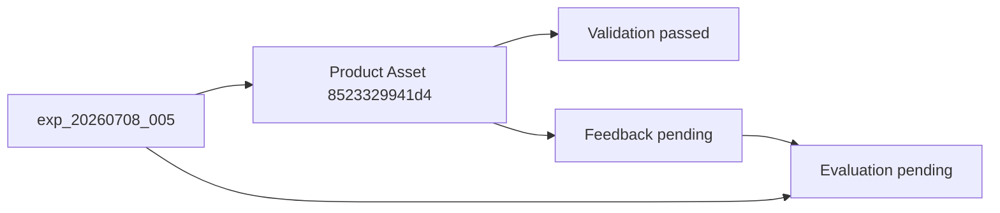

# Commercial Asset Lifecycle Report

> Entry 038-A | commercial_assets/ 审计

---

## 资产总览

**目录：** `commercial_assets/`  
**文件总数：** 26（17 JSON + pilot artifact 副本 + 1 MD + 文本/二进制产物）  
**Python 写入：** ❌ 当前代码 **不自动写入** commercial_assets（adapter/validator 注释明确禁止）

---

## 分类清单

### 1. 配置 / 注册类

| 文件 | 对象 | 数量 | 创建方式 |
|------|------|------|----------|
| `opportunity_candidates/opportunity_candidates_v1.json` | Candidate | 5 | human_assisted |
| `opportunities/opportunities_v1.json` | Opportunity | 5 | human_assisted |
| `experiment_selection/experiment_selection_records_v1.json` | Selection | 1 batch | human_assisted |

---

### 2. 状态 / 流程类

| 文件 | 对象 | 关键状态 |
|------|------|----------|
| `experiments/experiments_v1.json` | Experiment | 4 条，**全部 status=draft** |
| `experiment_reviews/experiment_reviews_v1.json` | Review | prepared 3 / rejected 1 |
| `production_requests/production_requests_v1.json` | PR | 3 条，**全部 status=draft** |
| `production_request_reviews/production_request_reviews_v1.json` | Approval | 3 approved |

**状态不一致：** Review/Approval 已完成，但源 Experiment/PR JSON 仍标记 `draft`。

---

### 3. 商业资产类

| 文件 | 对象 | 数量 |
|------|------|------|
| `product_assets/product_assets_v1.json` | Product Asset | **1**（8523329941d4） |
| `product_asset_validations/product_asset_validations_v1.json` | Validation | **1** passed |
| `pilot_outputs/preq_20260712_005/` | Pilot 执行产物副本 | generation_log, drafts, artifacts |

---

### 4. 反馈数据类

| 文件 | 对象 | 状态 |
|------|------|------|
| `feedback/feedback_v1.json` | Feedback | 1 条，`pending`, `metric_value: null`, `observation_period: not_started` |

---

### 5. 实验数据类

| 文件 | 对象 | 状态 |
|------|------|------|
| `experiment_evaluations/experiment_evaluations_v1.json` | Evaluation | 1 条，`hypothesis_result: pending`, 市场 actuals 全 null |

---

## Product Asset 生命周期（Pilot 实例）

```
opp_20260708_005 (Opportunity JSON)
  → exp_20260708_005 (Experiment JSON, draft)
  → preq_20260712_005 (PR JSON, draft, P0)
  → appr_20260713_005 (Approval JSON, approved)
  → [Adapter --execute] CF artifacts 8523329941d4
  → product_assets_v1.json (Product Asset, generation_status=completed, validation_status=passed)
  → product_asset_validations_v1.json (passed, quality 0.89)
  → feedback_v1.json (fbk_20260713_001, pending)
  → experiment_evaluations_v1.json (eval_20260713_001, pending)
  → [Observation] NOT STARTED
```

---

## 关系完整性检查

| 关系 | 源 ID | 目标 ID | JSON 一致 |
|------|-------|---------|-----------|
| Product Asset → PR | 8523329941d4 | preq_20260712_005 | ✅ |
| Product Asset → Experiment | 8523329941d4 | exp_20260708_005 | ✅ |
| Product Asset → Approval | 8523329941d4 | appr_20260713_005 | ✅ |
| Validation → Product Asset | pval_* | 8523329941d4 | ✅ |
| Feedback → Product Asset | fbk_20260713_001 | 8523329941d4 | ✅ |
| Evaluation → Experiment | eval_20260713_001 | exp_20260708_005 | ✅ |

---

## Product Asset / Validation / Feedback / Evaluation 关系



| 环节 | Runtime 自动 | 当前值 |
|------|-------------|--------|
| Product Asset 创建 | ❌ 人工/Entry | completed |
| Validation 执行 | ⚠️ Validator 代码存在，Pilot 人工登记结果 | passed |
| Feedback 采集 | ❌ | pending, null metrics |
| Evaluation 结论 | ❌ | pending, null actuals |

---

## pilot_outputs 目录

**路径：** `commercial_assets/pilot_outputs/preq_20260712_005/`

| 文件 | 用途 |
|------|------|
| generation_log.json | 执行日志 |
| product_asset_draft.json | Adapter 输出草稿副本 |
| product_asset_validation.json | 验证结果副本 |
| pilot_execution_summary.json | 执行摘要 |
| artifacts/ | CF artifact 副本（xlsx, pdf, publish_package） |

**与 canonical 关系：** Product Asset SoT 为 `product_assets_v1.json`；pilot_outputs 为执行快照。

---

## 未生产 PR 状态

| PR ID | Approval | Adapter 可执行 | Product Asset |
|-------|----------|----------------|---------------|
| preq_20260712_001 | approved | ❌ pilot block | ❌ |
| preq_20260712_004 | approved | ❌ pilot block | ❌ |
| preq_20260712_005 | approved | ✅ executed | ✅ 8523329941d4 |

---

## 与 CF storage 重复

| 位置 | 产品 ID | 说明 |
|------|---------|------|
| commercial_assets/product_assets | 8523329941d4 | 正式商业资产 |
| 11_CONTENT_FACTORY/storage/product_memory.json | 8523329941d4 + 历史产品 | CF 运行时缓存 |
| 11_CONTENT_FACTORY/artifacts/products/ | 8523329941d4 | 物理 artifact |

---

## 结论

1. **Commercial Assets 链完整（JSON 层）** — ID 引用一致，Pilot 单产品走通
2. **无 Python 自动生命周期管理** — 全部 human_assisted 登记
3. **Feedback/Evaluation 为占位实例** — 无市场数据，符合 Entry 035 约束
4. **Experiment/PR status=draft 与下游 Approval/Production 不同步** — 文档/状态治理问题
