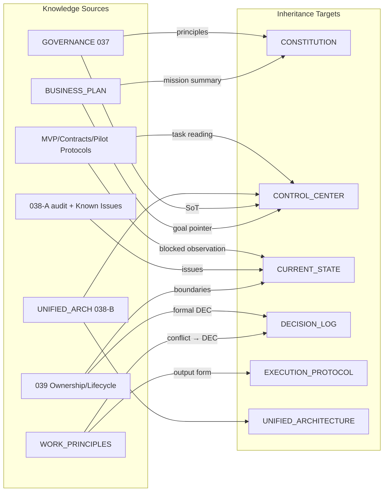

# AI_FACTORY_OS Knowledge Migration Map Report

> **知识迁移地图审计报告** | Knowledge Migration Map Audit（只分析，不执行迁移）  
> **Date:** 2026-07-15  
> **Scope:** `docs/` 全部 Markdown（审计时点：**85** 文件）  
> **前置输入：** `docs/07_AUDIT/structure/AI_FACTORY_OS_KNOWLEDGE_GOVERNANCE_AUDIT_REPORT.md`  
> **Constraint：** 本阶段**只建立迁移地图**。未修改任何既有 Markdown / Python / Database / commercial_assets / Runtime；未删除、移动、重命名；未创建核心控制文件；未做架构调整。  
> **唯一产出：** 本报告（`docs/audit/` 下审计产出，非核心控制文件）。

---

## 0. 执行摘要

| 项 | 结论 |
|----|------|
| **目标** | 为未来知识继承画出路线：什么知识从哪来 → 继承到哪个既有目标文件 |
| **不做的事** | 不粘贴内容、不改控制层、不归档、不删文件 |
| **继承原则** | Prefer **摘要 + DEC-ID + 指针** 进入控制层；详文留在原 Blueprint/Audit |
| **最高优先继承包** | 使命与商业目标、Blueprint≠Runtime、双轨现实、Human Assisted、数据边界、协作协议（040-A）、重大错误与否决规则、Pilot 锚点 |
| **关键阻塞** | 旧 WORK_PRINCIPLES vs 新治理；BUSINESS_PLAN「已完成」叙事 vs Current State；MODULE_REGISTRY vs Reality |

**类型图例（本报告统一使用）：**

| 类型代码 | 含义 |
|----------|------|
| **CORE** | 核心认知 |
| **GOV** | 治理规则 |
| **ARCH** | 架构设计 |
| **STATE** | 当前状态 |
| **DEC** | 决策历史 |
| **EXEC** | 执行记录 |
| **HIST** | 历史参考 |
| **DEP** | 废弃候选（仅标记降级/归档倾向，**禁止删除**） |

有效性：`Y` 有效 · `Y*` 有效但需 Reality 核对 / 含过时片段 · `F` 时点冻结仍有效参考

---

## 1. 全量文件分类

### 1.1 控制与权威层

| 文件名称 | 用途 | 创建背景 | 来源 Entry | 有效性 | 类型 |
|----------|------|--------|------------|--------|------|
| `AI_FACTORY_OS_CONTROL_CENTER.md` | 会话唯一入口；阶段/目标/禁止；Bootstrap | Collaboration Control | CCS / 040-A | Y | CORE + GOV |
| `AI_FACTORY_OS_PROJECT_CONSTITUTION.md` | 使命、永久原则、禁止行为 | Collaboration Control | CCS | Y | CORE + GOV |
| `AI_FACTORY_OS_CURRENT_STATE.md` | 事实摘要（完成/阻塞/问题） | Collaboration Control | CCS | Y*（缺 040-A 条） | STATE + CORE |
| `AI_FACTORY_OS_DECISION_LOG.md` | 关键决策 DEC-001..004 | Collaboration Control | CCS | Y | DEC + CORE |
| `AI_FACTORY_OS_EXECUTION_PROTOCOL.md` | 执行前后；可读性；自检门 | Collaboration Control | CCS / 040-A | Y | GOV + CORE |
| `AI_FACTORY_OS_AUTHORITY_MODEL.md` | Reality→…→Chat 权威序 | Collaboration Control | CCS | Y | GOV + CORE |
| `AI_FACTORY_OS_DOCUMENTATION_MAP.md` | 控制层 vs 知识层路由 | Collaboration Control | CCS | Y | GOV |

### 1.2 工程状态与执行台账

| 文件名称 | 用途 | 创建背景 | 来源 Entry | 有效性 | 类型 |
|----------|------|--------|------------|--------|------|
| `PROJECT_STATUS.md` | 工程进度与 Entry 叙事 | Project Context Layer | 持续 / 040-A | Y* | EXEC + STATE*投影 |
| `system_snapshot.md` | 架构恢复与快照 | Project Context Layer | 持续 / 040-A | Y* | EXEC + HIST |
| `CURSOR_EXECUTION_HISTORY.md` | Cursor/Entry 台账 | Project Intelligence | 持续 | Y | EXEC |

### 1.3 早期长期记忆（商业 / 工作协议）

| 文件名称 | 用途 | 创建背景 | 来源 Entry | 有效性 | 类型 |
|----------|------|--------|------------|--------|------|
| `AI_FACTORY_OS_BUSINESS_PLAN.md` | 愿景、收入模型、半自动策略 | 早期商业规划 | 早期（无 Entry 编号） | Y* | CORE + HIST |
| `AI_FACTORY_OS_WORK_PRINCIPLES.md` | 人机协作、升级策略 | 早期长期记忆 | 早期 + 后续追加 | Y*冲突 | GOV + HIST + **DEP倾向（规则层）** |

### 1.4 系统治理与统一架构

| 文件名称 | 用途 | 创建背景 | 来源 Entry | 有效性 | 类型 |
|----------|------|--------|------------|--------|------|
| `AI_FACTORY_OS_SYSTEM_GOVERNANCE_PROTOCOL.md` | 横向治理、SoT、状态词汇 | 治理层建设 | **037** | Y | GOV + CORE |
| `AI_FACTORY_OS_UNIFIED_ARCHITECTURE.md` | 统一目标架构（非 Runtime 完成） | 架构收敛 | **038-B** | Y | ARCH + CORE |
| `AI_FACTORY_OS_STATE_AUTHORITY_PROTOCOL.md` | 状态域权威 | DB/JSON 权威 | **039-A** | Y | GOV + ARCH |
| `AI_FACTORY_OS_PROJECT_INTELLIGENCE_BLUEPRINT.md` | 文档智能总蓝图 | Project Intelligence | 早期 PI | Y | ARCH |
| `AI_FACTORY_OS_MODULE_REGISTRY.md` | 模块职责与状态地图 | 模块登记 | 持续 / **038-B** | Y*冲突 | ARCH + STATE* |
| `AI_FACTORY_OS_HUMAN_ASSISTED_BOUNDARY_PROTOCOL.md` | 人辅边界、商业结论人工确认 | 商业状态权威 | **039-B** | Y | GOV + CORE |

### 1.5 Content Factory / Cognition / Data Intelligence

| 文件名称 | 用途 | 创建背景 | 来源 Entry | 有效性 | 类型 |
|----------|------|--------|------------|--------|------|
| `AI_FACTORY_OS_CONTENT_FACTORY_BLUEPRINT.md` | CF 架构设计 | CF 建设 | 早期 CF | Y | ARCH |
| `AI_FACTORY_OS_CONTENT_FACTORY_MONETIZATION_BLUEPRINT.md` | CF 货币化路径 | 商业化设计 | 早期 | Y | ARCH |
| `AI_FACTORY_OS_DATA_INTELLIGENCE_BLUEPRINT.md` | 数据智能战略 | DI 设计 | 早期 | Y | ARCH |
| `AI_FACTORY_OS_COGNITION_BLUEPRINT.md` | 2_COGNITION 层设计 | Cognition | 早期 | Y | ARCH |
| `AI_FACTORY_OS_COGNITION_AGENT_ARCHITECTURE_BLUEPRINT.md` | Cognition Agent 设计 | Agent 架构 | 早期 | Y | ARCH |
| `AI_FACTORY_OS_CONTENT_FACTORY_INTEGRATION_DESIGN.md` | CF 与 OS 集成设计 | 集成 | 商业验证链 | Y | ARCH |
| `AI_FACTORY_OS_CONTENT_FACTORY_ADAPTER_IMPLEMENTATION_PLAN.md` | Adapter 实施方案 | Adapter | CF Adapter Entries | Y* | ARCH + HIST |
| `AI_FACTORY_OS_CONTENT_FACTORY_ADAPTER_ARCHITECTURE_AUDIT.md` | Adapter 审计时点 | 审计 | Adapter Audit | F | HIST |

### 1.6 商业验证栈（MVP → Pilot Observation）

| 文件名称 | 用途 | 创建背景 | 来源 Entry | 有效性 | 类型 |
|----------|------|--------|------------|--------|------|
| `AI_FACTORY_OS_COMMERCIAL_MVP_BLUEPRINT.md` | 商业 MVP 验证蓝图 | 商业验证准备 | 商业 MVP | Y | ARCH + CORE |
| `AI_FACTORY_OS_COMMERCIAL_EXPERIMENT_SYSTEM_BLUEPRINT.md` | 实验体系 | 实验管理 | 实验 Entries | Y | ARCH + CORE |
| `AI_FACTORY_OS_EXPERIMENT_OBJECT_REGISTRY.md` | 实验对象登记规范 | 对象体系 | 实验 Entries | Y | ARCH |
| `AI_FACTORY_OS_COMMERCIAL_EXPERIMENT_SELECTION_FRAMEWORK.md` | 实验选择规则 | 选择框架 | 实验 Entries | Y | ARCH |
| `AI_FACTORY_OS_OPPORTUNITY_CANDIDATE_REGISTRY.md` | Candidate 登记 | 机会池 | Opportunity Entries | Y | ARCH |
| `AI_FACTORY_OS_OPPORTUNITY_DATASET_GENERATION_RULE.md` | Candidate 数据生成 / SOP | 数据规范 | Opportunity Entries | Y | GOV + ARCH |
| `AI_FACTORY_OS_COMMERCIAL_INTELLIGENCE_CONTRACT.md` | 商业智能 Object 契约 | Contract Layer | PI / Contract | Y | ARCH + CORE |
| `AI_FACTORY_OS_PRODUCTION_REQUEST_CONTRACT.md` | PR 契约 | 生产请求 | PR Entries | Y | ARCH |
| `AI_FACTORY_OS_EXPERIMENT_PREPARED_REVIEW_PROTOCOL.md` | 实验准备审核 | Review | Review Entries | Y | GOV + ARCH |
| `AI_FACTORY_OS_PRODUCT_ASSET_CONTRACT.md` | Product Asset 契约 | PA | PA Entries | Y | ARCH |
| `AI_FACTORY_OS_PRODUCT_ASSET_VALIDATION_GATE.md` | Validation Gate 设计 | 验收门禁 | Validation Entries | Y | ARCH |
| `AI_FACTORY_OS_VALIDATION_GATE_INTEGRATION_PLAN.md` | Gate 接入计划（未连 Runtime） | 038-B 对齐 | **038-B** | Y | ARCH |
| `AI_FACTORY_OS_FEEDBACK_OBJECT_CONTRACT.md` | Feedback 契约 | 反馈层 | Feedback Entries | Y | ARCH |
| `AI_FACTORY_OS_EXPERIMENT_EVALUATION_FRAMEWORK.md` | 实验评估框架 | Evaluation | Eval Entries | Y | ARCH |
| `AI_FACTORY_OS_PILOT_OBSERVATION_PROTOCOL.md` | Pilot 观察协议 | 观察（未开始） | Observation Design | Y | ARCH + CORE |

### 1.7 Database / Ownership（含 039-A 与更早）

| 文件名称 | 用途 | 创建背景 | 来源 Entry | 有效性 | 类型 |
|----------|------|--------|------------|--------|------|
| `AI_FACTORY_OS_DATABASE_SCHEMA_BLUEPRINT.md` | Schema 设计 | DB 设计 | Database Design | Y* | ARCH |
| `AI_FACTORY_OS_DATABASE_REALITY_AUDIT.md` | DB 现实早期审计 | 审计 | Reality Audit | F | HIST |
| `AI_FACTORY_OS_DATABASE_MIGRATION_PLAN.md` | Additive 迁移计划 | 迁移设计 | Migration Design | Y | ARCH |
| `AI_FACTORY_OS_DATABASE_INTEGRATION_DESIGN.md` | 跨模块 DB Contract | 集成 | Integration Design | Y | ARCH |
| `AI_FACTORY_OS_DATABASE_EXTENSION_IMPLEMENTATION_PLAN.md` | Step 0–5 实施规范 | 扩展计划 | Extension Plan | Y | ARCH |
| `AI_FACTORY_OS_DATABASE_ALIGNMENT_REPORT.md` | DB 对齐报告 | 对齐 | **038-B** | F | HIST |
| `AI_FACTORY_OS_DATABASE_INVENTORY_REPORT.md` | DB 盘点 | 治理盘点 | **039-A** | Y | HIST + ARCH |
| `AI_FACTORY_OS_SCHEMA_DRIFT_REPORT.md` | Schema 漂移证据 | 漂移审计 | **039-A** | Y | HIST + CORE |
| `AI_FACTORY_OS_DATA_OWNERSHIP_MODEL.md` | 数据所有权模型 | Ownership | **039-A** | Y | GOV + CORE |
| `AI_FACTORY_OS_JSON_DATABASE_BOUNDARY_REPORT.md` | JSON vs DB 边界 | 边界 | **039-A** | Y | GOV + CORE |
| `AI_FACTORY_OS_DATABASE_EVOLUTION_PLAN.md` | DB 演化规划（仅规划） | 未来迁移 | **039-A** | Y | ARCH |

### 1.8 Commercial Lifecycle / Field / Migration（039-B/C/D）

| 文件名称 | 用途 | 创建背景 | 来源 Entry | 有效性 | 类型 |
|----------|------|--------|------------|--------|------|
| `AI_FACTORY_OS_COMMERCIAL_OBJECT_INVENTORY.md` | 商业对象盘点 | 生命周期治理 | **039-B** | Y | HIST |
| `AI_FACTORY_OS_COMMERCIAL_LIFECYCLE_STATE_MACHINE.md` | 目标生命周期机 | 状态机设计 | **039-B** | Y | ARCH + CORE |
| `AI_FACTORY_OS_COMMERCIAL_STATE_AUTHORITY_MODEL.md` | 状态 Writer 权威 | 权限模型 | **039-B** | Y | GOV + CORE |
| `AI_FACTORY_OS_COMMERCIAL_STATE_CONFLICT_REPORT.md` | 历史 vs 目标冲突 | 冲突证据 | **039-B** | Y | HIST + CORE |
| `AI_FACTORY_OS_COMMERCIAL_STATE_ALIGNMENT_REPORT.md` | 商业状态对齐 | 对齐 | **038-B** | F | HIST |
| `AI_FACTORY_OS_COMMERCIAL_FIELD_CURRENT_INVENTORY.md` | 字段现实盘点 | 字段规范化 | **039-C** | Y | HIST |
| `AI_FACTORY_OS_COMMERCIAL_FIELD_STANDARD.md` | 字段标准维 | 标准 | **039-C** | Y | ARCH + CORE |
| `AI_FACTORY_OS_COMMERCIAL_FIELD_MAPPING_MODEL.md` | 字段映射 | 映射 | **039-C** | Y | ARCH |
| `AI_FACTORY_OS_COMMERCIAL_FIELD_COMPATIBILITY_REPORT.md` | 字段兼容性 | 兼容风险 | **039-C** | Y | HIST |
| `AI_FACTORY_OS_STATE_TRANSITION_AUTHORITY_MATRIX.md` | 谁可改哪类字段 | 转换权限 | **039-C** | Y | GOV + CORE |
| `AI_FACTORY_OS_COMMERCIAL_STATE_HISTORICAL_SNAPSHOT.md` | 迁移前冻结快照 | 迁移策略 | **039-D** | F | HIST + CORE |
| `AI_FACTORY_OS_COMMERCIAL_STATE_MIGRATION_MATRIX.md` | 当前→目标矩阵 | 迁移映射 | **039-D** | Y | ARCH |
| `AI_FACTORY_OS_PILOT_STATE_MIGRATION_ANALYSIS.md` | Pilot 迁移分析 | preq_005 / PA | **039-D** | Y | ARCH + STATE*建议 |
| `AI_FACTORY_OS_STATE_MIGRATION_PERMISSION_POLICY.md` | 自动 vs 人工迁移边界 | 权限 | **039-D** | Y | GOV + CORE |
| `AI_FACTORY_OS_STATE_MIGRATION_ROLLBACK_PLAN.md` | 回滚预案 | 回滚 | **039-D** | Y | GOV |
| `AI_FACTORY_OS_STATE_MIGRATION_RISK_REPORT.md` | 迁移风险 | 风险评估 | **039-D** | Y | HIST |

### 1.9 资产治理与损坏入口

| 文件名称 | 用途 | 创建背景 | 来源 Entry | 有效性 | 类型 |
|----------|------|--------|------------|--------|------|
| `AI_FACTORY_OS_ASSET_LIFECYCLE_POLICY.md` | 资产生命周期政策 | 资产治理 | Asset Governance | Y | GOV |
| `AI_FACTORY_OS_ASSET_AUDIT.md` | 资产审计规范 | 规范 | Asset Governance | Y | GOV |
| `AI_FACTORY_OS_ASSET_AUDIT_TEMPLATE.md` | 审计模板 | 模板 | Asset Governance | Y | HIST |
| `AI_FACTORY_OS_ASSET_SCAN_REPORT.md` | 扫描时点报告 | 扫描 | Asset Scan | F | HIST + **DEP倾向（时点）** |
| `AI_FACTORY_OS_BROKEN_ENTRY_REPORT.md` | 损坏入口登记 | 保护入口 | Asset / Broken | Y | HIST + CORE |

### 1.10 `docs/audit/`

| 文件名称 | 用途 | 创建背景 | 来源 Entry | 有效性 | 类型 |
|----------|------|--------|------------|--------|------|
| `audit/1_AI_FACTORY_OS_MODULE_AUDIT.md` | 模块审计 | 全系统审计 | **038-A** | F | HIST |
| `audit/2_MODULE_BOUNDARY_REPORT.md` | 模块边界冲突 | 边界 | **038-A** | F | HIST + CORE |
| `audit/3_RUNTIME_FLOW_REPORT.md` | Runtime 双轨流 | 调用链事实 | **038-A** | F | HIST + CORE |
| `audit/4_CONTENT_FACTORY_REALITY_REPORT.md` | CF Isolated Active | CF 现实 | **038-A** | F | HIST |
| `audit/5_DATA_INTELLIGENCE_REPORT.md` | DI 流现实 | 数据流 | **038-A** | F | HIST |
| `audit/6_DATABASE_ASSET_REPORT.md` | DB 资产审计 | 存储 | **038-A** | F | HIST |
| `audit/7_COMMERCIAL_ASSET_REPORT.md` | 商业资产生命周期现实 | JSON | **038-A** | F | HIST |
| `audit/8_DOCUMENT_CONFLICT_REPORT.md` | 文档 vs Reality 冲突 | 冲突 | **038-A** | F | HIST + CORE |
| `audit/9_MEMORY_ARCHITECTURE_REPORT.md` | Memory 架构现实 | 7_MEMORY | **038-A** | F | HIST |
| `audit/10_KNOWN_ISSUES.md` | P0/P1 问题清单 | 问题库 | **038-A** | Y | HIST + CORE |
| `audit/AI_FACTORY_OS_COLLABORATION_CONTROL_VALIDATION_REPORT.md` | CCS 验证 PASS | 验证 | CCS | F | HIST |
| `audit/AI_FACTORY_OS_KNOWLEDGE_GOVERNANCE_AUDIT_REPORT.md` | 知识治理审计 | 治理缺口 | Knowledge Governance Audit | Y | HIST + GOV |
| `audit/AI_FACTORY_OS_KNOWLEDGE_MIGRATION_MAP_REPORT.md` | 本迁移地图 | 继承路线 | Knowledge Migration Map Audit | Y | HIST + GOV |

**分类计数（主类型；多标签文件按主角色计）：**

| 类型 | 约数 | 说明 |
|------|------|------|
| CORE（含多标签） | ~25 文件含核心片段 | 真正需摘要继承的 ≤15 主题 |
| GOV | ~15 | 协议/边界/权限 |
| ARCH | ~30 | 蓝图/契约/计划 |
| STATE | ~3 控制+投影 | Current State 权威；Status/Snapshot 投影 |
| DEC | 1 主文件 | Decision Log 过薄 |
| EXEC | 3 | Status / Snapshot / History |
| HIST | ~25 | 审计与时点报告 |
| DEP 倾向 | 若干时点扫描 + WORK_PRINCIPLES **规则权威性** | **禁止删除文件** |

---

## 2. 知识资产地图（长期继承知识）

### 2.1 必须长期继承的八类知识

| # | 主题 | 有价值内容（摘要） | 当前分散来源 | 继承优先级 |
|---|------|-------------------|--------------|------------|
| 1 | **商业目标** | 可落地盈利优先；半自动 Human-in-the-loop；三层收入愿景；商业验证阶段非 SaaS 幻想落地 | BUSINESS_PLAN；Constitution Mission；MVP Blueprint | P0 |
| 2 | **项目使命** | AI 运营的商业生产系统；Governable growth；Governance Before Expansion | Constitution；Governance Protocol | P0 |
| 3 | **系统架构理念** | Data→…→Feedback→Memory；Blueprint≠Runtime；Alignment≠Refactor；双轨现实 | UNIFIED_ARCHITECTURE；audit/3；Constitution | P0 |
| 4 | **模块边界** | Core OS ≠ CF Runtime；2_COGNITION 空 vs MarketAgent；Deploy 有效 vs Product API 损坏；禁止无授权 merge | MODULE_REGISTRY；audit/2；Broken Entry；Control Center Forbidden | P0 |
| 5 | **数据边界** | commercial_assets = Commercial SoT；DB = Operational；Memory ≠ Commercial；Schema drift；JSON 同步须授权 | Data Ownership；JSON-DB Boundary；State Authority；Schema Drift；039-* | P0 |
| 6 | **AI 协作规则** | Bootstrap；Required Reading 最小集；Human Readability；Self Review Gate；用户审核材料中文为主；Scope 控制；发现无关问题只记录 | Control Center；Execution Protocol；WORK_PRINCIPLES（部分）；040-A | P0 |
| 7 | **历史重大决策** | CCS 层 DEC-001..004；尚缺：禁止 auto 商业成功、JSON 迁移人工、双轨未融合前禁止 Runtime merge、不删历史文档 | Decision Log（不全）；039 Permission；Human Assisted Protocol | P0 |
| 8 | **已发现错误与避坑规则** | ISSUE-P0/P1；DC-001..；draft≠approved；Isolated Active；self_healing / api_server 损坏；core_state orphan | audit/10；audit/8；Current State；Broken Entry | P0 |

### 2.2 Pilot 与口令（永不丢失）

| 锚点 / 口令 | 继承目标 |
|-------------|----------|
| `preq_20260712_005` · Product Asset `8523329941d4` | Constitution（已有）+ Current State（保持） |
| Blueprint ≠ Runtime | Constitution + Control Center Forbidden |
| Design ≠ Production | Governance + Execution Protocol |
| Human Assisted ≠ Automation（商业结论） | Constitution + **应升格 DEC** + Human Assisted Protocol |

### 2.3 知识资产分层图

```
┌─────────────────────────────────────────────────────────┐
│ L0 Reality（非 docs） Runtime / Code / DB / Assets      │
└────────────────────────────┬────────────────────────────┘
                             │ Authority
┌────────────────────────────▼────────────────────────────┐
│ L1 Control  CONSTITUTION · CONTROL_CENTER · CURRENT_STATE│
│            DECISION_LOG · EXECUTION_PROTOCOL · AUTHORITY │
└────────────────────────────┬────────────────────────────┘
                             │ 指针 / 摘要继承
┌────────────────────────────▼────────────────────────────┐
│ L2 Strategic Design  UNIFIED_ARCHITECTURE · GOVERNANCE   │
│   BUSINESS_PLAN · MVP/Experiment · Ownership / Lifecycle │
└────────────────────────────┬────────────────────────────┘
                             │ 按需
┌────────────────────────────▼────────────────────────────┐
│ L3 Contracts & Plans  PR/PA/Feedback/Gate/Adapter Plans  │
└────────────────────────────┬────────────────────────────┘
                             │ 只读回溯
┌────────────────────────────▼────────────────────────────┐
│ L4 Evidence  audit/* · Snapshots · Conflict/Drift reports│
│ L5 Ledger    PROJECT_STATUS · snapshot · HISTORY         │
└─────────────────────────────────────────────────────────┘
```

**迁移含义：** 知识「向上」变成摘要/DEC/指针；「原始文件」留在 L2–L5，**不删除、不合并成新核心文件**。

---

## 3. 核心知识继承路线（迁移地图主表）

> **继承 = 未来写入目标文件的摘要/指针/DEC，不是本阶段拷贝。**  
> 目标仅使用**既有**文件：Constitution / Control Center / Current State / Decision Log / Execution Protocol / Architecture Document（`UNIFIED_ARCHITECTURE`）/ 其他现有专文。

### 3.1 按重要源文件

| 原始文件 | 有价值内容 | 是否需要继承 | 建议继承目标 |
|----------|------------|--------------|--------------|
| `BUSINESS_PLAN.md` | 愿景；半自动策略；盈利优先；收入结构 | **是（摘要）** | **PROJECT_CONSTITUTION**（使命补充指针）；Control Center（商业目标指针）；**勿**把「§2 已完成」当事实 |
| `WORK_PRINCIPLES.md` | 人机分工；完整指令；Current State Lock；风控半自动 | **部分** | **EXECUTION_PROTOCOL**（协作输出形态）；**DECISION_LOG**（裁决与旧「禁止分阶段」冲突）；降级其作为唯一治理源 |
| `SYSTEM_GOVERNANCE_PROTOCOL.md` | SoT；状态词汇；Governance Before Expansion | **是** | Constitution（已部分）；Authority Model（已对齐）；**DECISION_LOG** 补「状态词汇/SoT」战略确认 |
| `UNIFIED_ARCHITECTURE.md` | 统一分层；双轨；Not Started | **是（理念）** | **ARCHITECTURE DOCUMENT（本文件自身保持权威）**；Constitution §2（已有）；Control Center Focus/Forbidden |
| `MODULE_REGISTRY.md` | 模块地图 | **是（纠正后摘要）** | Current State（边界事实）；Registry 自身修正属后续 Entry；指针到 audit/2、audit/8 |
| `HUMAN_ASSISTED_BOUNDARY_PROTOCOL.md` | 商业结论仅人辅 | **是** | Constitution（已有原则）；**DECISION_LOG（正式 DEC）**；Execution Protocol Forbidden 交叉 |
| `DATA_OWNERSHIP_MODEL.md` + `JSON_DATABASE_BOUNDARY_REPORT.md` | 数据域边界 | **是** | Current State Known Issues/Blocked；State Authority Protocol（保留详文）；**DECISION_LOG**（边界确认） |
| `SCHEMA_DRIFT_REPORT.md` | ensure_schema 漂移 | **是** | **CURRENT_STATE**（已有摘要）；audit/10；未来 DB Entry 前复检 |
| `COMMERCIAL_LIFECYCLE_STATE_MACHINE.md` + `COMMERCIAL_STATE_AUTHORITY_MODEL.md` | 目标生命周期与 Writer | **是（规则摘要）** | Decision Log（禁止静默成功）；Control Center（商业任务 Required Reading 已有）；详文留源文件 |
| `STATE_MIGRATION_PERMISSION_POLICY.md` + `PILOT_STATE_MIGRATION_ANALYSIS.md` | 迁移人工边界；Pilot 建议未执行 | **是** | Current State Blocked；**DECISION_LOG**；Control Center Focus |
| `COMMERCIAL_STATE_HISTORICAL_SNAPSHOT.md` | 冻结现实 | **是（指针）** | Current State / Migration Entry；**永不覆写快照正文** |
| `COMMERCIAL_STATE_CONFLICT_REPORT.md` | CSC 冲突 | **是** | Current State；Decision（冲突处理策略） |
| `COMMERCIAL_MVP_BLUEPRINT.md` + Experiment/Contract 簇 | 验证栈设计 | **按需指针** | Control Center 任务相关阅读；不整本灌入控制层 |
| `PILOT_OBSERVATION_PROTOCOL.md` | 观察未开始 | **是（状态）** | **CURRENT_STATE** Blocked/Focus；Control Center |
| `audit/10_KNOWN_ISSUES.md` | ISSUE 列表 | **是** | **CURRENT_STATE**（摘要+指针）；重大者进 Decision「避坑」 |
| `audit/8_DOCUMENT_CONFLICT_REPORT.md` | DC 冲突 | **是** | Current State；后续 Registry/Status 对齐 Entry |
| `audit/2` + `audit/3` | 边界与 Runtime 流 | **是（理念）** | UNIFIED_ARCHITECTURE 前提；Current State 双轨 |
| `BROKEN_ENTRY_REPORT.md` | 损坏入口 | **是** | **CURRENT_STATE** Known Issues |
| `PROJECT_STATUS.md` / `system_snapshot.md` | Entry 进度叙事 | **否整本继承** | 保持 EXEC；冲突时以 Current State + Reality 为准；收尾同步规则见 §6 |
| `CURSOR_EXECUTION_HISTORY.md` | 台账 | **否**（保留执行记录） | 自身；Control Center 不加载全文 |
| `CONTROL_CENTER` 等控制文件 | 已是目标层 | N/A | **目标，不是源迁移对象** |
| 时点审计 `audit/1,4–7,9`、Adapter Audit、Asset Scan | 证据 | **指针级** | Current State / Known Issues 引用；**不迁入宪法正文** |
| Knowledge Governance Audit Report | 缺口清单 | **是（整改输入）** | 指导后续 Docs-only Entry；本地图与其互补 |

### 3.2 按「目标文件」汇总：应接收什么

| 继承目标 | 应接收的知识形态 | 不接收 |
|----------|------------------|--------|
| **PROJECT_CONSTITUTION** | 使命、永久原则、Pilot 锚点、口令、商业目标一级摘要 | 字段清单、Entry 流水、审计正文 |
| **CONTROL_CENTER** | Phase、Primary Goal、Forbidden、Required Reading 指针、Bootstrap | 长蓝图全文 |
| **CURRENT_STATE** | Completed/In Progress/Blocked、Known Issues 摘要、Pilot IDs、实施未开始项 | 决策辩论、设计推导 |
| **DECISION_LOG** | 战略选择、否决方案、边界确认（补 037–039 级 DEC） | 日常 Entry 完成记录（→ HISTORY） |
| **EXECUTION_PROTOCOL** | 执行门禁、可读性、自检、范围控制、输出形态（完整指令） | 商业状态机全文 |
| **ARCHITECTURE DOCUMENT**（`UNIFIED_ARCHITECTURE.md`） | 分层模型、双轨与收敛约束、Not Started 诚实声明 | 协作礼仪细节 |
| **其他现有文件** | 详文继续住在 Ownership / Lifecycle / Contracts / audit | 禁止新建平行「第二宪法」 |

### 3.3 建议未来 DEC 升格清单（迁移执行时用，本阶段不写）

| 建议 DEC 主题 | 源 |
|---------------|-----|
| 商业结论禁止自动化写入 / Human Assisted Only | Human Assisted Boundary；Migration Permission |
| 商业 JSON 状态同步仅授权 Entry | 039-D；Current State Blocked |
| 双轨未融合前禁止 Core OS↔CF Runtime merge | Control Center；Unified Architecture |
| Scope-controlled Entry 优先于「禁止分阶段整体升级」旧文 | WORK_PRINCIPLES vs Governance / 040-A |
| 文档冲突以 Reality 为准；Status「Active」须区分 Isolated | audit/8 DC-001 |
| 不删除历史治理文档 | DEC-002 已有（保持） |

---

## 4. 文件关系分析

### 4.1 关系总图



### 4.2 关系规则（未来执行迁移时遵守）

1. **一对多禁止失控：** 同一原则最多「宪法一条 + DEC 一条 + 源协议详文」；禁止第三份平行「总原则」。  
2. **Status/Snapshot 不是继承目标主脑：** 它们消费 Current State，而不是反向定义 Reality。  
3. **审计文件是证据层：** 只被 Current State / Decision 引用，不升格为 Required Reading 默认全文。  
4. **冲突未裁决前：** 新会话以 Control Center + Authority Model + Current State 为准；旧 WORK_PRINCIPLES 冲突段落视为 **待裁决源**。

---

## 5. 冲突列表

| 冲突编号 | 冲突内容 | 影响 | 建议裁决方向 |
|----------|----------|------|--------------|
| **KM-C-001** | `WORK_PRINCIPLES`：优先整体升级、禁止过度 V1/V2/V3 拆分 **vs** Governance Before Expansion + Entry Scope Control + 040-A Self Review | AI 倾向扩大单次改造或拒绝合理分 Entry | **以控制层为准**：允许范围受控的分 Entry；整体方案可作为「方案输出」但执行必须 Scope；用 DEC 标注 WORK_PRINCIPLES 对应条为 **Superseded for execution sizing** |
| **KM-C-002** | `WORK_PRINCIPLES`：「每次升级须含架构+商业+执行」**vs** 现代「单 Entry 单目标、禁止顺手修复」 | 任务膨胀、越权改 Python/DB | **裁决：** 商业/架构变更可分 Entry；单任务禁止捆绑未授权域；完整三件套改为「路线图层」要求而非每个 Cursor 任务 |
| **KM-C-003** | `BUSINESS_PLAN` §2「当前系统状态（已完成）」含产品层叙述 **vs** Current State / audit（9_PRODUCT API 损坏、双轨、CF Isolated） | 商业文件被当成完成证明 | **裁决：** BUSINESS_PLAN 的「已完成」降级为历史愿景附录；事实以 Current State + Reality；后续 Docs Entry 加「状态无效声明」横幅（仍不删文件） |
| **KM-C-004** | MODULE_REGISTRY：10_DEPLOY「Frozen」**vs** Reality：Deploy 为有效 HTTP 入口（DC-005） | 维护者忽略真实入口或重复造 API | **裁决：** Reality 优先；Registry 状态字段应对齐 audit/8；摘要进入 Current State |
| **KM-C-005** | MODULE_REGISTRY / Cognition Blueprint「设计就绪」语气 **vs** 2_COGNITION 0 文件 + MarketAgent 在 CF（DC-004） | 误以为 Cognition Runtime 可对接 | **裁决：** 显式 **Planned / Not Implemented**；边界问题保留在 audit/2 |
| **KM-C-006** | PROJECT_STATUS「PR Approval approved / Pilot Completed」**vs** JSON `status=draft`（DC-002/003） | 文档进度超前资产事实 | **裁决：** Asset Reality 优先；迁移前 Current State 保持「Strategy Ready / Sync Not Started」；禁止用 Status 文案覆盖 JSON |
| **KM-C-007** | PROJECT_STATUS「Content Factory Active」**vs** Isolated Active / 非 OS 主链（DC-001） | 误判端到端自动化 | **裁决：** 术语强制 **Isolated Active**；写入控制层风险表（已有 R3 类） |
| **KM-C-008** | UNIFIED_ARCHITECTURE 长期「统一」**vs** 近期 Forbidden「未经授权禁止 Runtime merge」 | 方向误解为「现在就该融合」 | **裁决：** 统一 = **目标蓝图**；近程 = **治理与商业验证**；融合仅授权 Architecture Entry |
| **KM-C-009** | Decision Log 仅 CCS 决策 **vs** 039 协议中大量「禁止自动…」事实规则 | 新会话重复讨论已定边界 | **裁决：** 后续 Docs-only Entry 将关键禁止项 **升格 DEC**（继承路线 §3.3） |
| **KM-C-010** | Current State 缺 Entry 040-A **vs** Control Center / Execution Protocol / PROJECT_STATUS 已标 040-A | 控制层事实摘要滞后 | **裁决：** 下次状态同步 Entry 补一条 Completed（不在本任务改） |
| **KM-C-011** | Adapter Implementation Plan（计划口吻）**vs** Adapter Code/Regression 已完成（Status） | 读者不知 Plan 是否过时 | **裁决：** Plan 标为 **Historical Plan + pointer to Completed Runtime**（后续标注）；权威完成态在 Current State |
| **KM-C-012** | 早期「自动商业决策」措辞（WORK_PRINCIPLES/BUSINESS_PLAN）**vs** Constitution「商业验证能力受控 / 非失控自动化」 | 使命语言打架 | **裁决：** Constitution + Human Assisted 优先；「自动」限生产辅助，**不含**商业成功裁定 |

---

## 6. 更新触发规则（未来知识更新规则）

| 变化类型 | 必须更新 | 应当更新 | 条件更新 Decision Log | 明确不要做 |
|----------|----------|----------|----------------------|------------|
| **商业变化**（目标/阶段/半自动策略） | Constitution（使命级）；Control Center Primary Goal；Current State | BUSINESS_PLAN；MVP 相关 Blueprint 指针 | **是** | 静默改 commercial_assets；只改聊天 |
| **架构变化**（分层/双轨/融合授权） | UNIFIED_ARCHITECTURE；Current State；Control Center Focus/Forbidden | MODULE_REGISTRY；system_snapshot | **是** | 未授权改 Runtime/Python |
| **模块变化**（新目录/职责迁移） | MODULE_REGISTRY；Current State | UNIFIED_ARCHITECTURE；Broken Entry（若损坏） | 边界冲突时 **是** | 无 Ownership 写入 SoT |
| **重大错误发现** | Current State Known Issues；`audit/10` 或新 audit 条 | Conflict Report；Control Center Risks | 改变权威规则时 **是** | 同任务未授权「顺手修复」 |
| **工作协议变化** | EXECUTION_PROTOCOL；必要时 CONTROL_CENTER Bootstrap | WORK_PRINCIPLES（标注谁优先）；DOCUMENTATION_MAP | **是** | 双文件矛盾并存不写 DEC |
| **商业 JSON / Pilot 状态同步** | Current State；Historical Snapshot（只读引用）；Migration 执行报告 | PROJECT_STATUS / HISTORY；Pilot Analysis 关闭条件 | **是**（授权范围） | 无 Entry 改 JSON；自动写 commercial success |
| **Database schema / Ownership** | Current State；Schema Drift / Ownership 相关报告 | DATABASE_* 蓝图 | **是** | 静默 ALTER；docs 宣称 Implementation Completed |
| **文档体积/新建设计文** | DOCUMENTATION_MAP / Control Center Required Reading 评估 | Decision（是否需要新文） | 若新增控制解释权 **是** | 新建第二控制中心或平行宪法 |

**强制顺序（任一触发）：**

```
Reality 核对 →（战略则）DECISION_LOG → CURRENT_STATE → CONTROL_CENTER（若阶段/目标/禁止变）
  → PROJECT_STATUS / system_snapshot / CURSOR_EXECUTION_HISTORY（Entry 收尾）
  → 专文 Blueprint/Contract（仅当设计真正变化）
```

---

## 7. 后续执行建议

> 以下均为**建议**，本审计**不执行**。

### 7.1 建议下一 Entry（Docs-only Knowledge Inheritance Execution）

1. **裁决 KM-C-001/002/012** → 写入 DECISION_LOG（Supersede 标注，不删 WORK_PRINCIPLES）。  
2. **升格 §3.3 DEC 清单**（Human Assisted、JSON 同步、禁止 Runtime merge）。  
3. **CURRENT_STATE** 补 Entry 040-A；加强 Known Issues → audit/10 指针。  
4. **CONTROL_CENTER** 增加「核心认知指针」短表（Business / Architecture / Known Issues）——仍禁止塞全文。  
5. **BUSINESS_PLAN** 仅加「状态以 Current State 为准」说明条（若授权改该文件）。  
6. **不**在该 Entry 改 Python / DB / commercial_assets / 执行 039 迁移。

### 7.2 明确不会出现在迁移执行中的动作

- 删除或重命名任何 Markdown  
- 新建核心控制文件  
- 把 85 个文件合并成一个  
- 把 audit 全文搬进 Constitution  

### 7.3 与知识治理审计的关系

| 报告 | 角色 |
|------|------|
| Knowledge Governance Audit | **缺口与完整性评估** |
| **本报告 Migration Map** | **继承路线、冲突裁决方向、更新触发器** |

二者一起构成：先知道「缺什么」→ 再知道「迁到哪」。

---

## 8. 本阶段约束核对

| 约束 | 结果 |
|------|------|
| 只分析 / 只建地图 | **Yes** |
| 修改既有 Markdown | **No** |
| 创建核心控制文件 | **No** |
| 删除/移动/重命名 | **No** |
| Python / DB / commercial_assets / Runtime | **No** |
| 架构调整 | **No** |
| 产出迁移地图报告 | **Yes** — 本文件 |

---

## 9. 结论

知识迁移的正确姿势不是「搬文件」，而是：

1. **把八类长期知识摘要化**进入既有控制层目标文件；  
2. **把战略禁止与否决 DEC 化**；  
3. **用冲突表（KM-C-*）先裁决再写入**；  
4. **用更新触发规则防止再漂移**；  
5. **原文件全部保留为 L2–L5 证据与设计详文。**

本阶段迁移地图建立完成；继承执行须另开授权 Entry。

---

**Report status:** Completed — Knowledge Migration Map Audit（Analysis Only）
