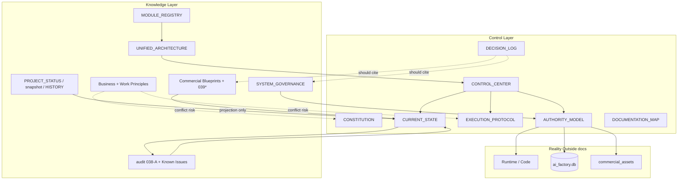

# AI_FACTORY_OS Knowledge Governance Audit Report

> **知识治理审计报告** | Entry / Phase: Knowledge Governance Audit（只读审计）  
> **Date:** 2026-07-15  
> **Scope:** `docs/` 下全部 Markdown（审计时点计数：**84**）  
> **Constraint:** 本阶段**仅审计**。未修改 Python / Database / commercial_assets / Runtime / 核心控制文件；未删除、未重命名；未创建新的核心控制文件。  
> **唯一产出：** 本报告文件。

---

## 0. 执行摘要（Executive Summary）

| 项 | 结论 |
|----|------|
| **文档体系真实状态** | 双层结构已立：Control Layer（控制层）+ Knowledge/Reference Layer（知识/参考层）；控制层可启动会话，但**历史关键认知未充分下沉**到 Decision Log / Constitution |
| **核心认知完整度** | 商业目标、双轨架构、Human Assisted、Blueprint≠Runtime、Pilot 锚点等**存在于多处**；统一「长期必读核心认知包」**尚未固化**在五个控制文件内 |
| **最大认知断层风险** | `PROJECT_STATUS.md` / `system_snapshot.md` / `CURSOR_EXECUTION_HISTORY.md` 体积过大；`WORK_PRINCIPLES.md` 与后续治理原则**存在冲突**；Decision Log 几乎**只有协作控制决策**，缺少 037–039 关键否决/边界决策的正式 ID |
| **废弃倾向** | **无文件建议立即删除**；若干报告属**时点冻结**（可归档标记，不可删）；业务叙事文件存在**过时声明**需在第二阶段对齐 |
| **本阶段动作** | 只记录缺口与建议；**不修改**核心控制文件 |

---

## 1. 当前文档体系真实状态

### 1.1 规模与分布

| 区域 | 文件数（约） | 角色 |
|------|-------------|------|
| `docs/` 根目录 | 73 | 蓝图、契约、状态、治理、盘点 |
| `docs/audit/` | 11 | Entry 038-A 全系统审计 + 协作控制验证 + **本报告** |
| **合计** | **84** | Markdown 知识资产全集 |

体积特征（认知负载）：

| 文件 | 约大小 | 风险 |
|------|--------|------|
| `PROJECT_STATUS.md` | ~62 KB | 进度 + 叙事叠层；易与 Reality 漂移 |
| `system_snapshot.md` | ~62 KB | 恢复说明与历史段落混杂 |
| `CURSOR_EXECUTION_HISTORY.md` | ~55 KB | 执行台账，不宜作会话启动主源 |
| `AI_FACTORY_OS_MODULE_REGISTRY.md` | ~38 KB | 模块地图；部分状态与 Reality 冲突（见 audit/8） |
| 多数 Blueprint/Contract | 5–27 KB | 深度参考，按需加载 |

### 1.2 官方两层结构（已存在）

依据 `AI_FACTORY_OS_DOCUMENTATION_MAP.md`：

```
CONTROL LAYER（会话解释权威）
  CONTROL_CENTER → CURRENT_STATE / AUTHORITY_MODEL / EXECUTION_PROTOCOL
  PROJECT_CONSTITUTION · DECISION_LOG · DOCUMENTATION_MAP · AUTHORITY_MODEL

KNOWLEDGE / REFERENCE LAYER（设计、历史、深参考）
  PROJECT_STATUS · system_snapshot · CURSOR_EXECUTION_HISTORY
  Blueprints / Contracts / Protocols / 039 系列 / audit/
```

**判断：** 分层设计正确；问题不在「有无入口」，而在**知识是否可被控制层继承与同步**。

### 1.3 文档资产完整清单（分类）

图例：

| 列 | 含义 |
|----|------|
| **有效** | 是否仍可作为当前参考（Y / Y*时效 / N*过时声明但仍保留） |
| **核心认知** | 长期运行应继承到控制层或必读指针 |
| **历史** | 时点记录 / 不可删审计 |
| **技术设计** | Blueprint / Contract / Plan |
| **执行记录** | Entry 台账 / 状态投影 |
| **可能废弃** | 可归档或降级（**非删除**） |

#### A. 控制层（Control Layer）

| 文件 | 创建目的 | 当前作用 | 有效 | 核心 | 历史 | 技术设计 | 执行 | 可能废弃 |
|------|---------|----------|------|------|------|----------|------|----------|
| `AI_FACTORY_OS_CONTROL_CENTER.md` | 会话唯一入口 | 阶段/目标/禁止/Bootstrap | Y | Y | N | N | N | N |
| `AI_FACTORY_OS_PROJECT_CONSTITUTION.md` | 使命与永久原则 | 宪法 | Y | Y | N | N | N | N |
| `AI_FACTORY_OS_CURRENT_STATE.md` | 事实摘要 | 已完成/进行中/阻塞/已知问题 | Y | Y | N | N | Y*投影 | N |
| `AI_FACTORY_OS_DECISION_LOG.md` | 关键决策 | DEC-001..004 | Y | Y | Y | N | N | N |
| `AI_FACTORY_OS_EXECUTION_PROTOCOL.md` | 执行前后规则 + 040-A 可读性/自检 | 任务执行协议 | Y | Y | N | N | Y | N |
| `AI_FACTORY_OS_AUTHORITY_MODEL.md` | 权威层级 | Reality>…>Chat | Y | Y | N | N | N | N |
| `AI_FACTORY_OS_DOCUMENTATION_MAP.md` | 控 vs 参 | 路由规则 | Y | Y | N | N | N | N |

#### B. 工程状态与执行台账

| 文件 | 创建目的 | 当前作用 | 有效 | 核心 | 历史 | 技术设计 | 执行 | 可能废弃 |
|------|---------|----------|------|------|------|----------|------|----------|
| `PROJECT_STATUS.md` | 工程进度总表 | Entry 进度与大量说明 | Y*需核对 Reality | 部分 | Y | N | Y | 可瘦身/拆分（不删） |
| `system_snapshot.md` | 架构恢复 | 快照 + 协作控制同步 | Y*混杂 | 部分 | Y | N | Y | 可瘦身 |
| `CURSOR_EXECUTION_HISTORY.md` | Cursor 执行史 | Entry 台账 | Y | N | Y | N | Y | N |

#### C. 商业目标与工作协议（早期长期记忆）

| 文件 | 创建目的 | 当前作用 | 有效 | 核心 | 历史 | 技术设计 | 执行 | 可能废弃 |
|------|---------|----------|------|------|------|----------|------|----------|
| `AI_FACTORY_OS_BUSINESS_PLAN.md` | 商业愿景与收入模型 | 商业目标参考 | Y*部分陈述过时 | Y | Y | N | N | 需对齐，不可删 |
| `AI_FACTORY_OS_WORK_PRINCIPLES.md` | 人机协作长期准则 | 仍被引用；与治理层有冲突 | Y*冲突 | Y | Y | N | N | **降级/冲突标注**（不删） |

#### D. 系统治理与统一架构

| 文件 | 创建目的 | 当前作用 | 有效 | 核心 | 历史 | 技术设计 | 执行 | 可能废弃 |
|------|---------|----------|------|------|------|----------|------|----------|
| `AI_FACTORY_OS_SYSTEM_GOVERNANCE_PROTOCOL.md` | Entry 037 横向治理 | SoT、状态词汇、ZIP 审计 | Y | Y | N | Y | N | N |
| `AI_FACTORY_OS_UNIFIED_ARCHITECTURE.md` | Entry 038-B 目标架构 | 双轨→统一蓝图 | Y | Y | N | Y | N | N |
| `AI_FACTORY_OS_STATE_AUTHORITY_PROTOCOL.md` | 状态域权威 | JSON/DB/Memory 边界 | Y | Y | N | Y | N | N |
| `AI_FACTORY_OS_PROJECT_INTELLIGENCE_BLUEPRINT.md` | Project Intelligence 总蓝图 | 文档智能层设计 | Y | 部分 | N | Y | N | N |
| `AI_FACTORY_OS_MODULE_REGISTRY.md` | 模块注册 | 目录职责地图 | Y*含冲突 | Y | N | Y | N | N |
| `AI_FACTORY_OS_HUMAN_ASSISTED_BOUNDARY_PROTOCOL.md` | 人辅边界 | 商业结论人工确认 | Y | Y | N | Y | N | N |

#### E. Content Factory / Monetization / Data Intelligence 蓝图

| 文件 | 创建目的 | 当前作用 | 有效 | 核心 | 历史 | 技术设计 | 执行 | 可能废弃 |
|------|---------|----------|------|------|------|----------|------|----------|
| `AI_FACTORY_OS_CONTENT_FACTORY_BLUEPRINT.md` | CF 设计 | CF 架构参考 | Y | 部分 | N | Y | N | N |
| `AI_FACTORY_OS_CONTENT_FACTORY_MONETIZATION_BLUEPRINT.md` | CF 商业化 | 货币化路径 | Y | 部分 | N | Y | N | N |
| `AI_FACTORY_OS_DATA_INTELLIGENCE_BLUEPRINT.md` | 数据智能 | 战略设计 | Y | 部分 | N | Y | N | N |
| `AI_FACTORY_OS_COGNITION_BLUEPRINT.md` | 2_COGNITION | 设计；Runtime 空 | Y | 部分 | N | Y | N | N |
| `AI_FACTORY_OS_COGNITION_AGENT_ARCHITECTURE_BLUEPRINT.md` | Cognition Agents | Agent 设计 | Y | N | N | Y | N | N |
| `AI_FACTORY_OS_CONTENT_FACTORY_INTEGRATION_DESIGN.md` | CF 集成 | 集成设计 | Y | 部分 | N | Y | N | N |
| `AI_FACTORY_OS_CONTENT_FACTORY_ADAPTER_IMPLEMENTATION_PLAN.md` | Adapter 计划 | 实施方案（已实现部分） | Y*历史+参考 | N | Y | Y | N | 可标 Implemented Pointer |
| `AI_FACTORY_OS_CONTENT_FACTORY_ADAPTER_ARCHITECTURE_AUDIT.md` | Adapter 审计 | 审计时点 | Y | N | Y | N | N | 归档倾向 |

#### F. 商业验证栈（MVP → Experiment → Contracts）

| 文件 | 创建目的 | 当前作用 | 有效 | 核心 | 历史 | 技术设计 | 执行 | 可能废弃 |
|------|---------|----------|------|------|------|----------|------|----------|
| `AI_FACTORY_OS_COMMERCIAL_MVP_BLUEPRINT.md` | 商业 MVP | 验证阶段蓝图 | Y | Y | N | Y | N | N |
| `AI_FACTORY_OS_COMMERCIAL_EXPERIMENT_SYSTEM_BLUEPRINT.md` | 实验体系 | 实验管理 | Y | Y | N | Y | N | N |
| `AI_FACTORY_OS_EXPERIMENT_OBJECT_REGISTRY.md` | 实验对象登记 | 对象规范 | Y | 部分 | N | Y | N | N |
| `AI_FACTORY_OS_COMMERCIAL_EXPERIMENT_SELECTION_FRAMEWORK.md` | 实验选择 | 选择规则 | Y | 部分 | N | Y | N | N |
| `AI_FACTORY_OS_OPPORTUNITY_CANDIDATE_REGISTRY.md` | 候选池 | Candidate 登记 | Y | 部分 | N | Y | N | N |
| `AI_FACTORY_OS_OPPORTUNITY_DATASET_GENERATION_RULE.md` | 数据生成规范 | Human Assisted SOP | Y | 部分 | N | Y | N | N |
| `AI_FACTORY_OS_COMMERCIAL_INTELLIGENCE_CONTRACT.md` | 商业智能契约 | Object 契约 | Y | Y | N | Y | N | N |
| `AI_FACTORY_OS_PRODUCTION_REQUEST_CONTRACT.md` | PR 契约 | 生产请求协议 | Y | 部分 | N | Y | N | N |
| `AI_FACTORY_OS_EXPERIMENT_PREPARED_REVIEW_PROTOCOL.md` | 准备审核 | 审核协议 | Y | 部分 | N | Y | N | N |
| `AI_FACTORY_OS_PRODUCT_ASSET_CONTRACT.md` | PA 契约 | 产品资产 | Y | 部分 | N | Y | N | N |
| `AI_FACTORY_OS_PRODUCT_ASSET_VALIDATION_GATE.md` | 验收门禁 | Validation Gate 设计 | Y | 部分 | N | Y | N | N |
| `AI_FACTORY_OS_VALIDATION_GATE_INTEGRATION_PLAN.md` | Gate 接入计划 | 计划；Runtime 未连 | Y | N | N | Y | N | N |
| `AI_FACTORY_OS_FEEDBACK_OBJECT_CONTRACT.md` | Feedback 契约 | 反馈对象 | Y | 部分 | N | Y | N | N |
| `AI_FACTORY_OS_EXPERIMENT_EVALUATION_FRAMEWORK.md` | 评估框架 | 实验评估 | Y | 部分 | N | Y | N | N |
| `AI_FACTORY_OS_PILOT_OBSERVATION_PROTOCOL.md` | Pilot 观察 | 观察协议；未开始 | Y | Y | N | Y | N | N |

#### G. Database / Ownership 系列（含 039-A 与更早）

| 文件 | 创建目的 | 当前作用 | 有效 | 核心 | 历史 | 技术设计 | 执行 | 可能废弃 |
|------|---------|----------|------|------|------|----------|------|----------|
| `AI_FACTORY_OS_DATABASE_SCHEMA_BLUEPRINT.md` | Schema 蓝图 | 设计；与 Reality 漂移 | Y* | 部分 | N | Y | N | N |
| `AI_FACTORY_OS_DATABASE_REALITY_AUDIT.md` | DB 现实审计 | 早期审计 | Y | N | Y | N | N | 归档倾向 |
| `AI_FACTORY_OS_DATABASE_MIGRATION_PLAN.md` | 迁移计划 | Additive 路线 | Y | 部分 | N | Y | N | N |
| `AI_FACTORY_OS_DATABASE_INTEGRATION_DESIGN.md` | 集成设计 | Cross-module contract | Y | 部分 | N | Y | N | N |
| `AI_FACTORY_OS_DATABASE_EXTENSION_IMPLEMENTATION_PLAN.md` | 扩展实施 | Step 0–5；未起步 | Y | N | N | Y | N | N |
| `AI_FACTORY_OS_DATABASE_ALIGNMENT_REPORT.md` | 对齐报告 | 对齐结论 | Y | N | Y | N | N | 归档倾向 |
| `AI_FACTORY_OS_DATABASE_INVENTORY_REPORT.md` | 039-A 清单 | DB 盘点 | Y | 部分 | Y | N | N | N |
| `AI_FACTORY_OS_SCHEMA_DRIFT_REPORT.md` | Schema 漂移 | 漂移证据 | Y | Y | Y | N | N | N |
| `AI_FACTORY_OS_DATA_OWNERSHIP_MODEL.md` | 数据所有权 | Ownership | Y | Y | N | Y | N | N |
| `AI_FACTORY_OS_JSON_DATABASE_BOUNDARY_REPORT.md` | JSON vs DB | 边界 | Y | Y | N | Y | N | N |
| `AI_FACTORY_OS_DATABASE_EVOLUTION_PLAN.md` | 演化计划 | 039-A 演化 | Y | 部分 | N | Y | N | N |

#### H. Commercial Lifecycle / Field / Migration（039-B/C/D）

| 文件 | 创建目的 | 当前作用 | 有效 | 核心 | 历史 | 技术设计 | 执行 | 可能废弃 |
|------|---------|----------|------|------|------|----------|------|----------|
| `AI_FACTORY_OS_COMMERCIAL_OBJECT_INVENTORY.md` | 对象盘点 | Inventory | Y | 部分 | Y | N | N | N |
| `AI_FACTORY_OS_COMMERCIAL_LIFECYCLE_STATE_MACHINE.md` | 生命周期机 | 目标状态机 | Y | Y | N | Y | N | N |
| `AI_FACTORY_OS_COMMERCIAL_STATE_AUTHORITY_MODEL.md` | 状态权威 | Writer 边界 | Y | Y | N | Y | N | N |
| `AI_FACTORY_OS_COMMERCIAL_STATE_CONFLICT_REPORT.md` | 冲突报告 | CSC 冲突 | Y | Y | Y | N | N | N |
| `AI_FACTORY_OS_COMMERCIAL_STATE_ALIGNMENT_REPORT.md` | 对齐报告 | 对齐 | Y | N | Y | N | N | 归档倾向 |
| `AI_FACTORY_OS_COMMERCIAL_FIELD_CURRENT_INVENTORY.md` | 字段盘点 | 字段现实 | Y | 部分 | Y | N | N | N |
| `AI_FACTORY_OS_COMMERCIAL_FIELD_STANDARD.md` | 字段标准 | 语义维隔离 | Y | Y | N | Y | N | N |
| `AI_FACTORY_OS_COMMERCIAL_FIELD_MAPPING_MODEL.md` | 字段映射 | 映射 | Y | 部分 | N | Y | N | N |
| `AI_FACTORY_OS_COMMERCIAL_FIELD_COMPATIBILITY_REPORT.md` | 兼容性 | 兼容风险 | Y | 部分 | Y | N | N | N |
| `AI_FACTORY_OS_STATE_TRANSITION_AUTHORITY_MATRIX.md` | 转换权限 | 谁可改状态 | Y | Y | N | Y | N | N |
| `AI_FACTORY_OS_COMMERCIAL_STATE_HISTORICAL_SNAPSHOT.md` | 历史快照 | 迁移前冻结 | Y | Y | Y | N | N | N（冻结） |
| `AI_FACTORY_OS_COMMERCIAL_STATE_MIGRATION_MATRIX.md` | 迁移矩阵 | 目标映射 | Y | Y | N | Y | N | N |
| `AI_FACTORY_OS_PILOT_STATE_MIGRATION_ANALYSIS.md` | Pilot 迁移分析 | preq_005 建议 | Y | Y | N | Y | N | N |
| `AI_FACTORY_OS_STATE_MIGRATION_PERMISSION_POLICY.md` | 迁移权限 | auto vs human | Y | Y | N | Y | N | N |
| `AI_FACTORY_OS_STATE_MIGRATION_ROLLBACK_PLAN.md` | 回滚 | 回滚预案 | Y | 部分 | N | Y | N | N |
| `AI_FACTORY_OS_STATE_MIGRATION_RISK_REPORT.md` | 迁移风险 | 风险评估 | Y | 部分 | Y | N | N | N |

#### I. 资产治理与损坏条目

| 文件 | 创建目的 | 当前作用 | 有效 | 核心 | 历史 | 技术设计 | 执行 | 可能废弃 |
|------|---------|----------|------|------|------|----------|------|----------|
| `AI_FACTORY_OS_ASSET_LIFECYCLE_POLICY.md` | 资产生命周期政策 | 资产治理 | Y | 部分 | N | Y | N | N |
| `AI_FACTORY_OS_ASSET_AUDIT.md` | 资产审计规范 | 规范 | Y | N | N | Y | N | N |
| `AI_FACTORY_OS_ASSET_AUDIT_TEMPLATE.md` | 审计模板 | 模板 | Y | N | N | Y | N | N |
| `AI_FACTORY_OS_ASSET_SCAN_REPORT.md` | 扫描报告 | 时点扫描 | Y | N | Y | N | N | 归档倾向 |
| `AI_FACTORY_OS_BROKEN_ENTRY_REPORT.md` | 损坏入口 | self_healing / api_server | Y | Y | Y | N | N | N |

#### J. `docs/audit/`（038-A + 验证 + 本报告）

| 文件 | 创建目的 | 当前作用 | 有效 | 核心 | 历史 | 技术设计 | 执行 | 可能废弃 |
|------|---------|----------|------|------|------|----------|------|----------|
| `audit/1_AI_FACTORY_OS_MODULE_AUDIT.md` | 模块审计 | 038-A | Y | 部分 | Y | N | N | N |
| `audit/2_MODULE_BOUNDARY_REPORT.md` | 边界冲突 | MB-* | Y | Y | Y | N | N | N |
| `audit/3_RUNTIME_FLOW_REPORT.md` | Runtime 流 | 双轨流图 | Y | Y | Y | N | N | N |
| `audit/4_CONTENT_FACTORY_REALITY_REPORT.md` | CF 现实 | Isolated Active | Y | 部分 | Y | N | N | N |
| `audit/5_DATA_INTELLIGENCE_REPORT.md` | DI 流 | 数据智能现实 | Y | N | Y | N | N | N |
| `audit/6_DATABASE_ASSET_REPORT.md` | DB 资产 | DB 审计 | Y | 部分 | Y | N | N | N |
| `audit/7_COMMERCIAL_ASSET_REPORT.md` | 商业资产 | JSON 生命周期 | Y | 部分 | Y | N | N | N |
| `audit/8_DOCUMENT_CONFLICT_REPORT.md` | 文档冲突 | DC-001.. | Y | Y | Y | N | N | N |
| `audit/9_MEMORY_ARCHITECTURE_REPORT.md` | Memory 架构 | Memory 边界 | Y | 部分 | Y | N | N | N |
| `audit/10_KNOWN_ISSUES.md` | 已知问题 | P0/P1 清单 | Y | Y | Y | N | N | N |
| `audit/AI_FACTORY_OS_COLLABORATION_CONTROL_VALIDATION_REPORT.md` | CCS 验证 | Foundation PASS | Y | N | Y | N | N | N |
| `audit/AI_FACTORY_OS_KNOWLEDGE_GOVERNANCE_AUDIT_REPORT.md` | 本审计 | 知识治理 | Y | Y | Y | N | N | N |

---

## 2. 长期运行必须保留的核心认知内容

下列内容视为 **Core Cognition Pack（核心认知包）** —— 不要求每会话全文加载，但必须能被 Control Layer **继承或指针可达**。

| # | 认知主题 | 当前主要载体 | 控制层是否已继承 |
|---|----------|--------------|------------------|
| 1 | **商业目标** — AI 驱动商业验证/半自动生产/可治理增长 | BUSINESS_PLAN；Constitution Mission | 部分（Mission 有；收入三层模型未进 Constitution） |
| 2 | **项目总体蓝图** — Data→…→Feedback→Memory | UNIFIED_ARCHITECTURE；Constitution §2 | 是（摘要级） |
| 3 | **系统架构理念** — Blueprint≠Runtime；双轨现实；Alignment≠Refactor | UNIFIED_ARCHITECTURE；Governance；audit/3 | Current State / Constitution 有；细节靠指针 |
| 4 | **模块边界** — Core OS vs CF；2_COGNITION 空 vs MarketAgent；Deploy vs Product API | MODULE_REGISTRY；audit/2；Broken Entry | Current State 摘要；REGISTRY 冲突未进 Decision |
| 5 | **AI 协作工作协议** — Bootstrap；可读性；自检；ChatGPT+Cursor 分工 | CONTROL_CENTER；EXECUTION_PROTOCOL；WORK_PRINCIPLES | 040-A 已进控制层；WORK_PRINCIPLES 冲突未裁决 |
| 6 | **当前项目状态** — Commercial Validation Preparation；迁移/观察未开始；Pilot 锚点 | CONTROL_CENTER；CURRENT_STATE；PROJECT_STATUS | 是；CURRENT_STATE 缺 Entry 040-A 显式条（缺口） |
| 7 | **历史关键决策** | DECISION_LOG（仅 4 条 CCS） | **不足** — 商业/数据库/迁移关键决策多在蓝图正文，未升格为 DEC-ID |
| 8 | **已发现重大问题** | audit/10；CURRENT_STATE Known Issues；Broken Entry | 摘要有；ISSUE-ID 未系统性入库 Decision/State |
| 9 | **已否决方案及原因** | DECISION_LOG Rejected Alternatives；039 Permission Policy（禁止 auto 商业成功） | **部分** — 仅协作控制层否决被正式记录；大量历史「禁止/拒绝」散落在协议中 |

**Pilot 锚点（不可丢失）：**

- Production Request：`preq_20260712_005`
- Product Asset：`8523329941d4`
- 原则：Pilot integrity（Constitution §4.7）

**三条永久判定口令（散落但应永存）：**

1. Blueprint ≠ Runtime  
2. Design ≠ Production  
3. Human Assisted ≠ Automation（商业结论）

---

## 3. 核心控制文件完整性评估（继承分析）

> 按任务要求：**只记录缺失，不修改。**

### 3.1 `AI_FACTORY_OS_PROJECT_CONSTITUTION.md`

| 检查项 | 状态 |
|--------|------|
| Mission / 长期方向 / 阶段 / 永久原则 / Forbidden | 完整（v1） |
| 继承：Human Assisted、Blueprint≠Runtime、Pilot 锚点 | 已有 |
| 继承：商业收入模型细节 | **缺失**（仅 Mission 级） |
| 继承：WORK_PRINCIPLES 与「禁止碎片化 / 整体升级优先」的冲突裁决 | **缺失** |
| Entry 040-A 规则 | 不应写入宪法细节；指向 Protocol 即可 — **可接受空白** |

### 3.2 `AI_FACTORY_OS_CONTROL_CENTER.md`

| 检查项 | 状态 |
|--------|------|
| Session Bootstrap Protocol | 完整（040-A） |
| Phase / Primary Goal / Forbidden / Required Reading | 完整 |
| 指向 CURRENT_STATE / AUTHORITY / EXECUTION | 完整 |
| 显式指针：KNOWN_ISSUES / UNIFIED_ARCHITECTURE / BUSINESS_PLAN | **弱**（任务相关才进 Required Reading；商业目标指针不足） |
| Entry 039 迁移策略文件 | Pilot/商业变更路径已列 |

### 3.3 `AI_FACTORY_OS_CURRENT_STATE.md`

| 检查项 | 状态 |
|--------|------|
| Completed / In Progress / Blocked / Known Issues | 结构正确 |
| Pilot 锚点与 039 实施未开始 | 已有 |
| Collaboration Control Foundation | 已有 |
| **Entry 040-A Completed** | **缺失显式条目**（缺口） |
| ISSUE-ID 与 audit/10 映射表 | **缺失**（仅散文列表） |
| MODULE_REGISTRY DC 冲突摘要 | **部分**（双轨有；Deploy Frozen 错误等未列） |

### 3.4 `AI_FACTORY_OS_DECISION_LOG.md`

| 检查项 | 状态 |
|--------|------|
| DEC-20260715-001..004（协作控制） | 完整 |
| 双轨架构作为长期决策（永久双轨 vs 收敛） | **未正式 DEC**（仅 Blueprint） |
| 「禁止自动写入商业成功」 | 在协议中；**未 DEC** |
| 「商业 JSON 迁移必须人工 Entry」 | 策略有；**未 DEC** |
| 「删除历史文档」否决 | 有（DEC-002 Rejected A） |
| 更早商业实验选型/Pilot 执行类否决方案目录 | **缺失** |

### 3.5 `AI_FACTORY_OS_EXECUTION_PROTOCOL.md`

| 检查项 | 状态 |
|--------|------|
| Before / During / After | 完整 |
| Human Readability Rule | 完整（040-A） |
| AI Self Review Gate | 完整（040-A） |
| 与 WORK_PRINCIPLES「完整文件替换 / 用户无代码能力」 | **未交叉引用**；可能双源维护 |
| Rollback Defaults | 有 |

### 3.6 旁注：控制层扩展文件（任务未要求改动）

`AUTHORITY_MODEL` 与 `DOCUMENTATION_MAP` 完整度高；是控制层一部分，但**不能替代** Decision Log 对历史否决方案的收录。

---

## 4. 文件关系分析（重要文件）

### 4.1 关系总图（逻辑）



### 4.2 关键簇 → 应被谁引用/继承

| 簇 / 文件 | 来源 Entry（约） | 创建原因 | 解决的问题 | 当前状态 | 应被谁引用或继承 |
|-----------|------------------|--------|------------|----------|------------------|
| System Governance Protocol | 037 | 横向治理 | Blueprint/Runtime 混淆、SoT | Blueprint Completed | Constitution 原则；Authority；Decision（缺） |
| Unified Architecture | 038-B | 双轨收敛设计 | 架构方向统一 | Blueprint；Runtime Not Started | Constitution §2；Control Center focus |
| audit/1–10 | 038-A | 全系统事实审计 | 认知 vs Reality | 历史冻结有效 | Current State；已知问题指针 |
| Data Ownership / Schema Drift / JSON-DB Boundary | 039-A | DB 治理 | 所有权与漂移 | Blueprint；Impl Not Started | Current State Blocked；State Authority |
| Lifecycle / Field / Migration | 039-B/C/D | 商业状态权威 | draft 不同步、字段语义混乱 | Strategy Ready；JSON 未改 | Control Center Required Reading（商业任务）；Decision（缺） |
| Collaboration Control + 040-A | CCS / 040-A | 会话稳定 | 上下文丢失 | Implemented（docs） | 全部会话入口 |
| Commercial MVP → Pilot Observation | 商业验证 Entries | 验证链设计 | 从机会到观察 | 设计完成；观察未开始 | Current State；Observation Protocol |
| WORK_PRINCIPLES / BUSINESS_PLAN | 早期长期记忆 | 协作与商业目标 | 人机分工、愿景 | 部分过时/冲突 | Constitution / Decision 需裁决后继承 |
| PROJECT_STATUS / snapshot / HISTORY | 持续 | 进度与恢复 | 工程叙事 | 有效但膨胀 | 执行后更新；**非**会话权威源 |
| Broken Entry Report | 资产审计线 | 损坏入口登记 | 非法 import 入口 | 有效 | Current State Known Issues |

---

## 5. 历史知识继承分析

### 5.1 已成功继承（摘要级）

- Reality 优先权威链 → Authority Model + Constitution  
- 双轨未融合事实 → Current State + Control Center Forbidden  
- Pilot 可追溯 → Constitution  
- 文档爆炸防控 → DEC-002 + Documentation Map  
- 会话启动与自检 → 040-A → Control Center / Execution Protocol  

### 5.2 未充分继承（缺口清单 — 仅记录）

| ID | 缺口 | 影响 |
|----|------|------|
| KG-GAP-001 | Decision Log 缺少 037–039 级「关键边界/否决」DEC 条目 | 新会话易重复讨论已否决方向（如自动商业成功、静默改 JSON） |
| KG-GAP-002 | WORK_PRINCIPLES「整体升级优先 / 禁止 V1V2 拆分」vs Governance Before Expansion / Scope control | AI 可能扩大范围或「一次大改」 |
| KG-GAP-003 | BUSINESS_PLAN「已完成」叙事（9_PRODUCT 等）与 Reality / audit 冲突 | 商业目标文件被当成完成证明 |
| KG-GAP-004 | CURRENT_STATE 未显式记录 Entry 040-A | 控制层事实滞后一步 |
| KG-GAP-005 | MODULE_REGISTRY DC-005/006（Deploy Frozen 误标等）未进入 Current State | 模块认知断层 |
| KG-GAP-006 | 否决方案无独立「Rejected Index」 | 只能靠全文搜索「禁止」 |
| KG-GAP-007 | PROJECT_STATUS / snapshot 双巨册与 Current State 三角同步无强制规则 | 进度文档互相漂移 |
| KG-GAP-008 | Adapter Plan「Implementation Plan」与「Code Completed」并存且无控制层指针 | 读者以为仍待实现或已全完成（需区分 Plan vs Runtime） |

### 5.3 与 `audit/8_DOCUMENT_CONFLICT_REPORT` 的继承关系

文档冲突报告已列出 P1 类冲突（Isolated Active 误读、PR/Experiment draft、Cognition 空目录等）。  
**Current State 已吸收一部分；未系统化为「冲突是否已解决」跟踪表。**  
结论：冲突知识存在，但**治理闭环未闭合**（发现 → 记录 → Decision → Current State 字段 → 关闭）。

---

## 6. 现有控制层完整性评分

| 维度 | 评分（1–5） | 说明 |
|------|-------------|------|
| 会话可启动性 | 5 | Bootstrap + Required Reading 足够启动 |
| 阶段/禁止清晰度 | 5 | Control Center 明确 |
| 事实摘要准确性 | 4 | 大体正确；缺 040-A；部分 MODULE 冲突未列 |
| 决策连续性 | 2 | 仅 CCS 决策；战略否决库薄 |
| 核心认知覆盖面 | 3 | 有指针能力，但核心包未完整下沉 |
| 与早期协议一致性 | 2 | WORK_PRINCIPLES 冲突未裁决 |
| 防文档爆炸 | 4 | 规则在；执行依赖代理人遵守 |
| **综合（控制层）** | **3.5 / 5** | **可运行入口完善；长期认知继承不足** |

---

## 7. 未来变更同步规则（设计建议 — 本阶段不实施）

当变化发生时，**最小必更新集**：

| 变化类型 | 必须更新 | 通常更新 | 按需追加 Decision | 禁止误动 |
|----------|----------|----------|-------------------|----------|
| **商业目标变化** | Constitution（Mission/方向）；Business Plan | Control Center Primary Goal；Current State | 是（新 DEC） | 勿只改聊天；勿静默改 commercial_assets |
| **架构变化** | Unified Architecture；Current State；Constitution §2 若永久 | MODULE_REGISTRY；system_snapshot | 是 | 勿未授权改 Runtime |
| **项目阶段变化** | Control Center Current Phase；Current State | PROJECT_STATUS 阶段表 | 若战略转折则是 | 勿把 Blueprint 标成 Completed Runtime |
| **新模块增加** | MODULE_REGISTRY；Current State；Documentation Map 指针 | Unified Architecture；Entry History | 边界冲突时是 | 勿无 Ownership 写入 SoT |
| **重大错误发现** | Current State Known Issues；`audit/10` 或新 audit 条目 | Broken Entry / Conflict Report | 若改变权威规则则是 | **禁止同任务顺手修复未授权项**（记录 only） |
| **工作协议变化** | Execution Protocol；必要时 Control Center Bootstrap | WORK_PRINCIPLES（明确谁优先）；Documentation Map | 是 | 勿双文件矛盾并存不标注 |

**同步顺序建议（永久机制草案）：**

```
1) Reality 核对
2) Decision Log（若战略）
3) Current State
4) Control Center（阶段/目标/禁止若变）
5) PROJECT_STATUS / system_snapshot / CURSOR_EXECUTION_HISTORY（Entry 收尾）
6) 专项 Blueprint/Contract（仅当设计真变）
```

---

## 8. 未来永久维护机制建议

1. **Core Cognition Pack 清单**  
   维护一张「必须继承主题表」（本报告 §2），控制在 ≤15 条主题；禁止每主题扩成新核心控制文件。

2. **Decision Log 升格规则**  
   凡「禁止某自动化 / 否决某架构选项 / 冻结某 Pilot 行为」→ 必须有 DEC-ID；协议正文可详述，但日志必须可检索。

3. **Current State 为唯一会话事实摘要**  
   PROJECT_STATUS 降级为「工程叙事与 Entry 目录」；冲突时以 Reality + Current State 为准（已有 Authority）。

4. **冲突登记闭环**  
   DC-/ISSUE- 关闭时更新 Current State；未关闭不得在 Primary Goal 中假设已解决。

5. **WORK_PRINCIPLES 冲突裁决**  
   第二阶段用一条 DEC 明确：Scope-controlled Entries **优先于**「禁止分阶段整体升级」旧条文（或相反）——必须二选一。

6. **体积治理**  
   不对历史文件删除；对新文采用「审计进 audit/、状态进 Current State、设计进既有 Blueprint」；拒绝平行「第二状态源」。

7. **可读性与自检**  
   延续 Entry 040-A：用户可见材料中文为主；重大方案过 AI Self Review Gate。

---

## 9. 第二阶段整改建议（仍不实施于本阶段）

优先级建议：

| 优先级 | 建议 | 性质 |
|--------|------|------|
| P0 | 用新 Entry **只改文档控制层**：补 DEC（Human Assisted 商业结论、JSON 同步须授权、双轨未融合前禁止 Runtime merge）；Current State 加 040-A；标注 WORK_PRINCIPLES 冲突 | Docs-only |
| P0 | 在 Control Center 增加「核心认知指针」小节：Business Goal / Known Issues / Unified Architecture（仍禁止塞满全文） | Docs-only |
| P1 | PROJECT_STATUS / system_snapshot **瘦身策略设计**（拆「当前一页」vs「历史附录」）——设计先于机械搬迁 | Docs design |
| P1 | MODULE_REGISTRY 状态与 audit/8 对齐计划（Deploy / Cognition） | Docs；或后续授权改 Registry |
| P2 | 建立 `Rejected / Superseded Index`（可放在 Decision Log 附录，**避免**新核心文件） | Docs-only |
| P2 | 商业目标文件与 Constitution Mission 对齐审查 | Docs-only |
| — | **不在知识治理整改中**处理 JSON 迁移、DB schema、Python 修复 | 保持 039 阻塞边界 |

---

## 10. 验证与约束核对（本审计）

| 约束 | 结果 |
|------|------|
| 扫描 docs/ 全部 Markdown | 完成（84） |
| 修改 Python | **No** |
| 修改 Database | **No** |
| 修改 commercial_assets | **No** |
| 修改 Runtime | **No** |
| 删除/重命名文件 | **No** |
| 创建新核心控制文件 | **No** |
| 改变架构方向 | **No** |
| 产出审计报告 | **Yes** — 本文件 |

---

## 11. 结论

知识体系已具备 **可用控制入口**，但仍处于 **「控制层薄、知识层厚、继承不全」** 状态。  
长期 AI 协作的主要断层，不是「缺少文档」，而是：

1. **关键否决与边界未 DEC 化**  
2. **早期工作准则与现代治理冲突未裁决**  
3. **巨册状态文档与 Current State 双源漂移**  
4. **核心认知包未强制指针化**

本阶段审计完成。整改须另开授权 Entry，并继续遵守：只记录无关问题、禁止越权修复 Reality。

---

**Report status:** Completed（Knowledge Governance Audit — Analysis Only）
